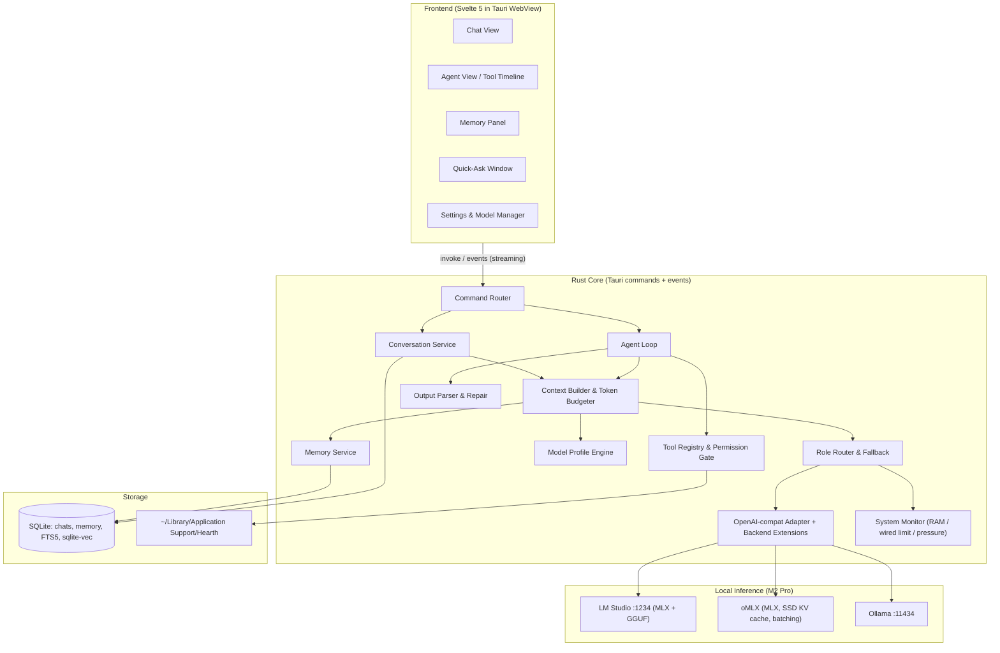
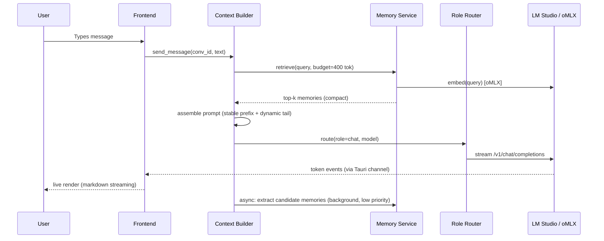
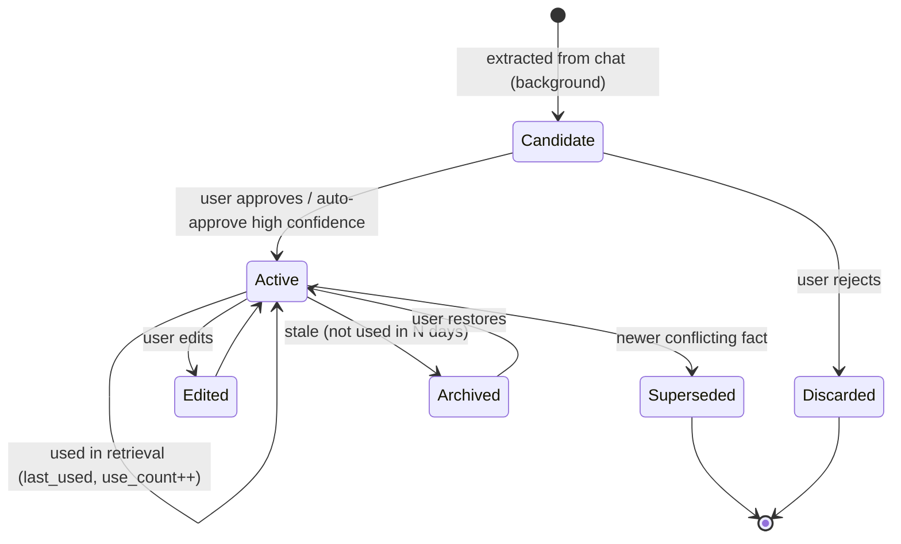

# Hearth — A Local-First Agent & Chat Harness for Small Models on macOS

> **Working name:** Hearth (rename freely). A warm, fast, private home for your local models.
>
> **One-liner:** A lightweight native Mac app for chatting with and running agents on local LLMs (≤35B parameters). It's built to get the most out of small models on an **M2 Pro with 32 GB**, served by **LM Studio** and **oMLX** (and sometimes **Ollama**), with a polished chat UI and memory you can see and edit.

---

## Table of Contents

1. [Vision](#1-vision)
2. [Goals & Non-Goals](#2-goals--non-goals)
3. [Target Hardware: M2 Pro 32 GB](#3-target-hardware-m2-pro-32-gb)
4. [Inference Backends: LM Studio, oMLX, Ollama](#4-inference-backends-lm-studio-omlx-ollama)
5. [Tech Stack](#5-tech-stack)
6. [Architecture](#6-architecture)
7. [Small-Model Optimisation Strategy (Core Differentiator)](#7-small-model-optimisation-strategy-core-differentiator)
8. [Feature Specification](#8-feature-specification)
9. [Memory System](#9-memory-system)
10. [Agent System](#10-agent-system)
11. [UI / UX Design](#11-ui--ux-design)
12. [Data Model](#12-data-model)
13. [Configuration](#13-configuration)
14. [Project Structure](#14-project-structure)
15. [Performance Budgets](#15-performance-budgets)
16. [Privacy & Security](#16-privacy--security)
17. [Testing & Evaluation](#17-testing--evaluation)
18. [Roadmap](#18-roadmap)
19. [Risks & Mitigations](#19-risks--mitigations)
20. [Open Questions](#20-open-questions)
21. [Appendix](#21-appendix)

---

## 1. Vision

Most chat/agent harnesses assume frontier-scale models: huge context windows, reliable native tool calling, and patience for 4,000-token system prompts. Small local models break under those assumptions. They lose track of long contexts, produce malformed tool calls, and slow down noticeably as the prompt grows.

**Hearth starts from the other end.** Every part of it is designed around the limits of 1B–35B models running on Apple Silicon:

- **Small prompts:** every token in the context has to earn its place.
- **Structured output:** tool calls are schema-constrained, so they parse every time.
- **Cache-friendly:** prompts are laid out so LM Studio and oMLX can reuse their KV caches, including oMLX's SSD-backed cache.
- **Memory without bloat:** retrieval is precise and compact instead of dumping a lot of text into context.
- **A UI that feels like a real Mac app**, not a web dashboard.

### Guiding Principles

| Principle | What it means in practice |
|---|---|
| **Light** | Small binary, low idle RAM, near-zero CPU when idle. The model should get the RAM, not the harness. |
| **Small-model native** | Every prompt, tool schema and memory injection is budgeted in tokens. |
| **Intuitive** | Works out of the box: detects LM Studio, oMLX and Ollama and is chatting within 30 seconds. |
| **Beautiful** | Native vibrancy, smooth streaming, careful typography, dark and light themes. |
| **Private** | Offline by default. No telemetry. Your data stays in one SQLite file. |
| **Transparent** | You can see exactly what was sent to the model, what memory was used, and what tools ran. |

---

## 2. Goals & Non-Goals

### Goals

- **G1:** Fast, pretty chat with streaming, markdown, code, LaTeX, images (for VLMs), branching and search.
- **G2:** An agent mode with reliable tool use on 4B–35B models, tuned for a 32 GB machine.
- **G3:** A long-term memory system that is visible, editable and controlled by the user.
- **G4:** First-class support for **LM Studio** and **oMLX**, with **Ollama** as a secondary option, all through one adapter layer.
- **G5:** Per-model "profiles" that automatically tune sampling, context and tool-call format for each model family, whether the weights are MLX or GGUF.
- **G6:** **Role-based backend routing:** e.g. chat goes to LM Studio, agent work and embeddings go to oMLX.
- **G7:** Lightweight: under 25 MB app bundle and under 150 MB idle RAM (excluding the model).
- **G8:** Keyboard-first, with a global quick-ask hotkey (like Spotlight).

### Non-Goals (for v1)

- Not an inference engine. Hearth **does not run models itself**; it drives LM Studio, oMLX and Ollama.
- Not a model trainer or fine-tuning tool.
- Not a multi-user or server deployment (single user, single machine, with optional LAN access from another Mac).
- Not a cloud-model client first. OpenAI-compatible remote endpoints *can* work, but they're never the default or the design target.
- No mobile or Windows builds.
- No complex multi-agent "swarms". Small models do better with a single, well-scoped agent loop.

---

## 3. Target Hardware: M2 Pro 32 GB

**Primary machine:** Apple **M2 Pro**, **32 GB** unified memory, **1 TB** SSD. Memory bandwidth is about **200 GB/s**, which caps how fast a model can generate tokens.

### 3.1 Memory Budget

By default, macOS lets the GPU use roughly **~21–22 GB** of the 32 GB (`iogpu.wired_limit_mb`). Advanced users can raise this to around 24–26 GB with `sudo sysctl iogpu.wired_limit_mb=<MB>`; the setting resets on reboot. Hearth reads the current limit and uses it when deciding whether a model fits.

```
32 GB unified memory
 ├─ macOS + your other apps      ~6–9 GB
 ├─ Hearth (harness)             < 0.15 GB
 ├─ Main LLM weights             ~12–19 GB   (sweet spot: 30B MoE @ 4-bit ≈ 17 GB)
 ├─ KV cache (context)           ~1–4 GB     (depends on model + context length)
 └─ Embedding (+ reranker)       ~0.6–1.5 GB (e.g. Qwen3-Embedding-0.6B)
```

**Design consequences:**

- **Only one large model is loaded at a time.** Background jobs (titles, summaries, memory extraction) **reuse the loaded main model** by default rather than loading a second "utility" model. If the main model is a fast MoE, this costs almost nothing.
- **A "Fits?" calculator** uses the real numbers: `wired_limit − currently loaded − weights − KV estimate(context)`. It shows green, amber or red before you load a model.
- **KV cache estimate** comes from the model config: `layers × kv_heads × head_dim × 2 (K+V) × bytes_per_elem × tokens`. Example for Qwen3-30B-A3B (48 layers, 4 KV heads, head_dim 128, fp16): about **96 KB/token**, so **32k context ≈ 3 GB**.
- **Memory-pressure monitor:** Hearth watches the system's memory pressure. When it gets high, it warns you and offers to unload a model or reduce the context.

### 3.2 What Runs Well (rough estimates for M2 Pro; measure with the built-in benchmark)

| Class | Example | Weights (4-bit) | Decode speed (approx.) | Role |
|---|---|---|---|---|
| **MoE ~30B (A3B)** ⭐ | Qwen3-30B-A3B (MLX 4-bit) | ~17 GB | **~45–70 tok/s** | **Daily driver: chat and agent** |
| MoE ~20B | gpt-oss-20b (MXFP4) | ~12 GB | ~40–60 tok/s | Agent / tool use |
| Dense 14B | Qwen3-14B, Phi-4 | ~8–9 GB | ~18–25 tok/s | Agent with room to spare |
| Dense 24B | Mistral Small 3.x | ~13–14 GB | ~12–16 tok/s | Strong all-rounder, vision |
| Dense 27–32B | Gemma 3 27B, Qwen3-32B | ~16–19 GB | ~8–12 tok/s | Max quality, slower |
| Dense ≤8B | Qwen3-8B, Qwen3-4B | ~2.5–5 GB | ~35–80 tok/s | Quick-ask, router, low-RAM mode |
| Embedding | Qwen3-Embedding-0.6B, nomic-embed-text | ~0.3–0.6 GB | n/a | Memory and RAG |
| Reranker | Qwen3-Reranker-0.6B / bge-reranker | ~0.6 GB | n/a | Optional retrieval boost (oMLX) |

> [!TIP]
> On a 32 GB Mac with 200 GB/s bandwidth, **MoE models with about 3B active parameters** are the best fit. They give roughly 30B-level quality at small-model speed. Hearth's defaults and onboarding recommend them first.

**Default context lengths:** 32k for ~30B MoE, 16k for dense 24–32B, and 32k+ for ≤14B. All can be changed per model.

### 3.3 Disk (1 TB SSD)

- The model library can grow large, especially if the same model is kept in both MLX and GGUF formats. The Model Manager shows **disk usage per backend** and **flags duplicates** (e.g. Qwen3-14B stored in LM Studio *and* Ollama).
- oMLX's **SSD-paged KV cache** gets a configurable disk budget in Hearth's recommendations (e.g. 20–50 GB). This is a good use of the SSD because it makes repeated agent prefixes almost free.

### 3.4 Secondary Machine (optional)

Hearth can also run on another Mac (e.g. an **M1 8 GB laptop**) as a *thin client* that points to LM Studio, oMLX or Ollama on the M2 Pro over the LAN. Memory and chats stay in the client's own DB (sync is P2).

---

## 4. Inference Backends: LM Studio, oMLX, Ollama

All three expose **OpenAI-compatible** endpoints, so Hearth has **one core adapter** (`openai_compat`) plus thin **backend-specific extensions** for model management, capabilities and caching.

### 4.1 Backend Matrix

| | **LM Studio** (primary) | **oMLX** (primary) | **Ollama** (secondary) |
|---|---|---|---|
| Default URL | `http://localhost:1234/v1` | configurable, see the oMLX menu bar app (auto-probe) | `http://localhost:11434` |
| Engines / formats | **MLX** + **GGUF** (llama.cpp) | **MLX** | GGUF |
| Chat API | OpenAI `/v1/chat/completions` | OpenAI `/v1/chat/completions` (+ Anthropic `/v1/messages`) | Native `/api/chat` + OpenAI `/v1` |
| Model listing | `/v1/models` + REST `/api/v0/models` (loaded state, arch, quant, max ctx, format) | `/v1/models` | `/api/tags`, `/api/ps` |
| Load / unload | JIT load on request, `ttl` auto-evict, `lms load/unload` CLI | Multi-model serving, managed in its app | `keep_alive`, auto-load |
| Structured output | `response_format: json_schema` ✅ | Probe at connect, otherwise parser fallback | `format: <json schema>` ✅ |
| Native tool calls | `tools` param ✅ (native for supported models, fallback otherwise) | Probe at connect | `tools` param ✅ |
| Prompt / KV cache | In-memory prompt cache (best for continuing the *same* conversation) | **Paged SSD KV cache**: restores earlier prefixes across chats, restarts and model swaps ⭐ | In-memory, per loaded model |
| Concurrency | Queue-based (Hearth serialises requests) | **Continuous batching**: background jobs run alongside chat ⭐ | Configurable parallelism |
| Embeddings | `/v1/embeddings` ✅ | ✅ (LLM + embedding + reranker served together) | `/api/embed` ✅ |
| Reranker | ❌ | ✅ | ❌ |
| Speculative decoding | ✅ draft model pairing | ? | ❌ |
| Vision | ✅ (VLMs) | Model-dependent | ✅ (VLMs) |

> [!NOTE]
> oMLX is a fast-moving community project (canonical repo: `jundot/omlx`). Hearth does **not hard-code oMLX capabilities**. On connect it runs a **capability probe** (a tiny structured-output request, a tiny tool call, embeddings, and whether a reranker is present) and caches the result per backend version.

### 4.2 Role-Based Routing (the default plan for your setup)

| Role | Default backend | Why |
|---|---|---|
| **Chat** | LM Studio | Best model library and management UX, MLX + GGUF, JIT loading, reliable `json_schema` |
| **Agent** | **oMLX** | Agent loops resend long, stable prefixes (system + tools + history). The SSD KV cache makes these almost free, and continuous batching lets the router and summaries run in parallel |
| **Embeddings** | oMLX (fallback: LM Studio) | Can stay loaded next to the LLM; a reranker is available |
| **Reranking** | oMLX (optional) | Improves memory and RAG precision at small `k` |
| **Background jobs** (titles, summaries, memory extraction) | Whichever backend already has a model loaded | Never loads a second large model |
| **Quick-ask** | Same as Chat | Instant if the model is warm |

Routing is fully configurable per role, and **per chat** you can override the model and backend from the model switcher. If a backend is down, Hearth falls back to the next one that has a compatible model (with a toast notification).

### 4.3 Model Identity Across Backends

The same model has different IDs in each backend:

```
LM Studio : qwen/qwen3-30b-a3b              (MLX or GGUF variant)
oMLX      : mlx-community/Qwen3-30B-A3B-4bit
Ollama    : qwen3:30b-a3b
```

Hearth normalises these to a **canonical model key**: family, size, variant, quant and format (e.g. `qwen3/30b-a3b/instruct/q4/mlx`). That key is used for:

- matching **model profiles** (§7.5),
- showing one entry with "available in: LM Studio · oMLX" badges,
- benchmarks and eval results,
- duplicate detection on disk.

### 4.4 Backend Control from Hearth

- **Auto-detect** on launch: probe the LM Studio, oMLX and Ollama default ports (plus user-defined URLs).
- **LM Studio:** if the server is off, offer **"Start LM Studio server"** (`lms server start`). Load a model with a chosen context length and TTL (`lms load`), and unload it to free RAM (`lms unload`).
- **oMLX:** show status and served models. Link out to the oMLX menu bar app for its settings, such as the SSD cache size.
- **Ollama:** list, pull, unload (`keep_alive: 0`).
- **Status pill** in the sidebar for each backend: ● running / ○ off / ⚠ error, with loaded models and RAM.

---

## 5. Tech Stack

### Decision: **Tauri 2 (Rust core) + Svelte 5 + Tailwind CSS**

| Layer | Choice | Why |
|---|---|---|
| App shell | **Tauri 2** | Bundle around 10 MB (vs ~150 MB for Electron). Uses the system WebKit. Native menus, tray, global shortcuts and vibrancy. |
| Core logic | **Rust** (tokio, reqwest, serde) | Fast, low memory, good streaming and concurrency. Owns the agent loop, memory and the backend adapters. |
| Frontend | **Svelte 5 (runes) + TypeScript** | Smallest runtime and fine-grained reactivity, which is good for token-by-token streaming. |
| Styling | **Tailwind CSS 4** + CSS variables | Fast iteration and themeable design tokens. |
| Components | **bits-ui / shadcn-svelte** (headless) | Accessible primitives, fully restylable. |
| Markdown | **markdown-it** + **Shiki** (code) + **KaTeX** (math) | Fast, and Shiki gives VS Code-quality highlighting. |
| Storage | **SQLite** (rusqlite) + **FTS5** + **sqlite-vec** | One file. Full-text and vector search in the same DB. |
| Tokenizer | **tokenizers** crate (HF `tokenizer.json`, read from the model folder when available) + heuristic fallback | Accurate token budgeting per model. |
| System info | `sysctl` / `host_statistics64` via Rust | Wired limit, memory pressure, RAM fit calculations. |
| Animations | Svelte transitions + CSS (spring curves) | Smooth without heavy libraries. |
| Icons | **Lucide** or SF Symbols-style SVGs | Matches macOS aesthetics. |

### Alternatives Considered

| Option | Pros | Cons | Verdict |
|---|---|---|---|
| **SwiftUI native** | Most native look, lowest RAM | Rich markdown/code/LaTeX rendering is painful, slower UI iteration | Strong runner-up; revisit for a "Hearth Lite" menu-bar app |
| **Electron** | Huge ecosystem | 150 MB+ bundle and 300 MB+ idle RAM, which takes memory away from the model | ❌ Rejected |
| **Python + web UI** | Easy ML integration | Needs a Python runtime, slow startup, distribution is painful | ❌ Rejected |
| **Pure web app (localhost)** | Simplest | No global hotkey, tray or native feel | ❌ Rejected |

---

## 6. Architecture



### Request Lifecycle (chat turn)



---

## 7. Small-Model Optimisation Strategy (Core Differentiator)

This section is the reason Hearth exists. Each technique is listed with its purpose and how it's implemented.

### 7.1 Token Budgeter

Every request is built against an explicit **budget**. Defaults for a ~30B MoE at 32k context:

```
context_window (e.g. 32768)
 ├─ reserved_output        2048   (configurable per profile)
 ├─ system_prompt           ≤300  (core persona + rules)
 ├─ tool_schemas            ≤600  (only active tools, compact form)
 ├─ memory_injection        ≤400  (top-k facts, 1 line each)
 ├─ conversation_summary    ≤600  (rolling summary of old turns)
 └─ recent_turns            remainder (newest first, until full)
```

- Token counts come from the model's own `tokenizer.json` when Hearth can find it in the LM Studio or oMLX model folder, falling back to a `chars / 3.5` heuristic. The backend's reported `usage` corrects the estimate after each turn.
- A **live budget meter** in the UI shows each slice as a stacked bar.
- When recent turns overflow, the oldest turns are **summarised** into the rolling summary in the background, never in the middle of a response.
- **Soft limit:** even if a model *supports* 128k, Hearth caps the default context at what fits in RAM (§3.1) and what keeps prompt processing fast. Long contexts slow small models down and make their answers worse.

### 7.2 KV-Cache-Friendly Prompt Layout

On Apple Silicon, **prompt processing (prefill)** is often the bottleneck for long chats and agent loops. Reusing the cache saves seconds per turn.

- **Stable prefix first:** system prompt → tool schemas → persona. These stay identical across turns and across chats that use the same persona.
- **Dynamic content last:** memory injection and retrieved docs go *after* the stable prefix, next to the user turn. If they changed every turn near the top of the prompt, they'd invalidate the cache.
- The rolling summary only changes in **chunks** (e.g. every N turns), not every turn.
- No timestamps or random IDs in the prefix. The current date goes into the dynamic tail.
- **Backend-aware strategy:**
  - **oMLX:** the paged SSD cache keeps prefixes **across conversations and restarts**. Hearth keeps system and tool blocks *byte-identical* so that every agent run starts warm.
  - **LM Studio:** the prompt cache mainly helps when you keep talking in the *same* chat. Switching chats costs a re-prefill, so Hearth shows a small "⟳ prefill" indicator and keeps prefixes short.
  - **Ollama:** uses a long `keep_alive` so the model isn't reloaded.
- The inspector shows **prefill time vs decode time** and an estimated **cache hit** for each turn, so you can see the effect.

### 7.3 Schema-Constrained Tool Calling

Small models often produce malformed JSON. Hearth avoids this in layers:

1. **Constrained decoding (preferred):** generate a JSON schema from the active tools (a `oneOf` over tool-call shapes plus a `final` answer) and send it as LM Studio `response_format: {type: "json_schema"}`, Ollama `format`, or oMLX's equivalent if the probe finds one. The model *cannot* produce invalid syntax.
2. **Native tool calling:** used when the profile marks the model as reliable (e.g. Qwen3, Mistral Small, gpt-oss) and the backend supports `tools`.
3. **Tolerant parser:** recognises the Hermes `<tool_call>` format, Qwen, Llama 3.x `<|python_tag|>`, Mistral `[TOOL_CALLS]`, Harmony (gpt-oss), and plain fenced JSON.
4. **JSON repair:** fixes trailing commas, single quotes, unclosed braces and stray prose around the JSON.
5. **Retry with feedback:** on a validation failure, send back a *short* error (`"arg 'path' missing"`) and retry at most twice.

The capability probe (§4.1) decides which layer is the default for each **backend × model** pair. The chosen strategy is shown in the inspector.

### 7.4 Minimal Tool Exposure (Tool Router)

Small models get confused when given more than about 5–8 tools.

- **Tool groups:** `files`, `web`, `shell`, `code`, `system`, `memory`.
- **Two-stage routing** (on automatically for dense models under 14B, optional for ~30B MoE):
  1. Stage 1: a cheap classification call with a constrained output enum: `{"group": "files" | "web" | ... | "none"}`. With oMLX's batching, this can run **in parallel** with memory retrieval.
  2. Stage 2: expose only that group's tools, with full schemas.
- **Compact schemas:** short descriptions (≤15 words), no nested objects where possible, enums instead of free text.
- **Per-tool few-shot examples** are included only for models that need them (set by a profile flag).

### 7.5 Model Profiles

Profiles are keyed by **model family**, not by backend or format, so the same profile applies to an MLX model in oMLX and a GGUF in LM Studio.

```toml
[profile.qwen3]
match = ["qwen3*", "Qwen3*"]
tool_format = "hermes"            # hermes | llama3 | mistral | harmony | json
native_tools = true
supports_thinking = true
thinking_tags = ["<think>", "</think>"]
thinking_toggle = { on = "/think", off = "/no_think" }
default_temperature = 0.6         # thinking; use 0.7 / top_p 0.8 for non-thinking
top_p = 0.95
top_k = 20
min_p = 0.0
needs_few_shot = false
max_tools = 8
default_context = 32768
vision = false

[profile.gpt_oss]
match = ["gpt-oss*"]
tool_format = "harmony"
native_tools = true
supports_thinking = true          # reasoning effort: low | medium | high
reasoning_effort_default = "low"
max_tools = 8
default_context = 32768

[profile.gemma3]
match = ["gemma3*", "gemma-3*"]
tool_format = "json"
native_tools = false
supports_thinking = false
default_temperature = 1.0
top_k = 64
top_p = 0.95
needs_few_shot = true
max_tools = 5
default_context = 16384
vision = true                     # 4b+

[profile.mistral_small]
match = ["mistral-small*", "Mistral-Small*"]
tool_format = "mistral"
native_tools = true
default_temperature = 0.15
max_tools = 8
default_context = 16384
vision = true
```

- Profiles ship built in, and the user can override them in Settings.
- **Unknown models** get a conservative default profile (JSON tool format, constrained decoding, few-shot on, max 5 tools, 8k context).
- Sampling parameters are always **sent explicitly** in requests, so results don't depend on whatever each backend's UI defaults happen to be.

### 7.6 Thinking-Model Handling

- Detect `<think>…</think>` and Harmony reasoning channels while streaming.
- Render them in a **collapsible "Thinking" disclosure** (dimmed, monospace, with elapsed time).
- **Strip thinking from history** before re-sending, which saves a lot of tokens.
- Per-chat toggle: **Fast** (no think / low effort) vs **Deep** (think / high effort). The agent loop can use "think" for planning and "no think" for tool execution.

### 7.7 Agent Loop Tuned for Small Models

- **Short horizon:** default max 10 steps, and the user can continue.
- **Explicit plan step** (on automatically for dense models under 14B, optional for 30B MoE): first produce a numbered plan of up to 5 bullets, constrained by schema, then execute it step by step.
- **Observation compression:** large tool outputs (web pages, files) are truncated or summarised to ≤600 tokens before they go back into context. The full output stays in the UI.
- **Scratchpad pruning:** earlier step observations are collapsed to one-line summaries once they've been used. Pruning only touches the **tail** of the prompt, so the cached prefix survives.
- **Loop detection:** identical tool calls repeated 2× trigger a nudge, and 3× stops the loop.

### 7.8 Retrieval That Fits

- Hybrid search: **FTS5 BM25 + vector similarity**, merged with reciprocal rank fusion, then **reranked with oMLX** when a reranker is available.
- **Top-k = 4–6** by default, each memory rendered as a **single line**.
- A relevance threshold means it's fine to inject nothing.
- Chunks for documents are small (~250–400 tokens) with headings kept as context.

### 7.9 Other Speed Tricks

- **Model warm-up:** optionally ping the default chat model on app launch so it's loaded (LM Studio JIT, or oMLX) before you type.
- **One big model at a time:** background jobs reuse the loaded model. Hearth never triggers a second large JIT load by accident; it checks the loaded models first (`/api/v0/models`, `/api/ps`).
- **Batching-aware scheduler:** on oMLX, background jobs run concurrently with low priority. On LM Studio, they're **queued** and paused while you're chatting.
- **Speculative decoding:** expose draft-model pairing for LM Studio (e.g. Qwen3-0.6B or 1.7B drafting for Qwen3-14B or 32B dense). It helps dense models most; MoE models gain less.
- **Cancelable requests:** stop generation instantly (⌘.) and cancel background jobs when a new turn starts.
- **Quant advisor:** suggests MLX 4-bit / 6-bit / 8-bit (or GGUF Q4_K_M / Q6_K) based on free memory and the target context.

---

## 8. Feature Specification

Priority: **P0** = MVP, **P1** = v1.0, **P2** = later.

### 8.1 Chat

| Feature | Priority | Notes |
|---|---|---|
| Streaming responses with smooth token rendering | P0 | Incremental markdown parse, 60 fps |
| Markdown, code blocks (Shiki), copy button, language label | P0 | |
| Stop / regenerate / edit-and-resend | P0 | |
| Model switcher per chat (⌘M) | P0 | Grouped by canonical model, with backend badges, size, quant, format, "Fits?" |
| Conversation list: search, pin, rename, delete | P0 | FTS5 search across all messages |
| Auto-generated chat titles | P0 | Uses the loaded model, ≤6 words, background |
| LaTeX (KaTeX) | P1 | |
| **Branching** (tree of message versions, ← 2/3 → switcher) | P1 | |
| File attachments (txt, md, pdf, code) with chunking | P1 | |
| Image input for vision models | P1 | Drag-drop, paste (Gemma 3, Mistral Small, Qwen-VL) |
| Folders / tags | P1 | |
| System prompt presets ("Personas") | P1 | |
| Per-message stats (tok/s, TTFT, prefill time, ctx used, backend) | P1 | Hover to reveal |
| Export chat (Markdown / JSON) | P1 | |
| Compare mode: same prompt, two models side by side | P2 | Sequential on LM Studio, parallel on oMLX if both fit |
| Voice input (on-device Whisper / macOS dictation) | P2 | |
| TTS read-aloud (macOS `AVSpeechSynthesizer`) | P2 | |

### 8.2 Agent Mode

| Feature | Priority |
|---|---|
| Toggle per chat: Chat ↔ Agent | P0 |
| Built-in tools: `read_file`, `list_dir`, `write_file`, `web_search`, `fetch_url`, `calculator` | P0 |
| Tool timeline UI (collapsible cards with args, output, duration) | P0 |
| Permission gate (ask / allow for session / always allow per tool) | P0 |
| Workspace folder scoping for file tools | P0 |
| `run_shell` (always asks, shows the command before running) | P1 |
| `run_python` (sandboxed subprocess, timeout) | P1 |
| **MCP client** (stdio + streamable HTTP) for external tools | P1 |
| Plan-then-execute mode | P1 |
| macOS tools: Clipboard, Notes, Reminders, Calendar (via AppleScript/Shortcuts) | P2 |
| Custom tools via simple manifest (`tools/*.toml` → script) | P2 |

### 8.3 Memory

See §9. P0: manual "Remember this" and a memory panel. P1: automatic extraction with review, episodic summaries, and reranking.

### 8.4 Quick-Ask (Spotlight-style)

- **Global hotkey** (default `⌥Space`) opens a floating, translucent input bar.
- One-shot answers with the currently loaded model (no model swap), with an option to expand into a full chat.
- Can include the clipboard or selected text as context (⌘⇧V).
- **P1**.

### 8.5 Menu Bar

- Tray icon showing status (loaded / idle / generating) and memory pressure.
- Quick actions: New chat, Quick-ask, switch default model, **unload model** (to free RAM), start the LM Studio server.
- **P1**.

### 8.6 Model & Backend Manager

| Feature | Priority |
|---|---|
| Auto-detect LM Studio / oMLX / Ollama, plus custom URLs | P0 |
| Unified model list (canonical keys), backend badges, size, quant, format (MLX/GGUF), max ctx | P0 |
| "Fits?" badge using wired limit + loaded models + KV estimate | P0 |
| Loaded models and RAM use (LM Studio `/api/v0/models`, Ollama `/api/ps`, oMLX probe) | P0 |
| Load / unload with context length + TTL (LM Studio `lms`, Ollama `keep_alive`) | P1 |
| Start LM Studio server from Hearth | P1 |
| Role routing editor (Chat / Agent / Embeddings / Rerank / Background) | P1 |
| Capability probe results per backend × model (structured output, tools, vision) | P1 |
| Built-in benchmark: TTFT, prefill tok/s, decode tok/s, cache-hit speed-up | P1 |
| Disk usage per backend + duplicate model detection | P2 |
| LAN mode: expose and use backends on the M2 Pro from another Mac | P2 |

### 8.7 Settings

- General: theme (system/light/dark), accent colour, font size, send-on-Enter vs ⌘Enter.
- Backends: endpoints, role routing, fallback order, capability probe refresh.
- Models: default chat/agent/embedding/reranker models, and profile overrides.
- Memory: enable/disable, auto-extract on/off, review mode, retention, re-embed.
- Agent: workspace folders, tool permissions, max steps.
- System: show wired limit, memory-pressure thresholds, low-RAM mode.
- Privacy: allow network tools (web search) on/off, and a clear-all-data button.
- Advanced: raw prompt inspector, log level, profile editor.

---

## 9. Memory System

Memory should feel like **a notebook the assistant keeps about you, that you can read and edit**. It should never feel like a black box.

### 9.1 Memory Layers

| Layer | What | Storage | Injected how |
|---|---|---|---|
| **Working** | Current conversation turns | messages table | Directly (budgeted) |
| **Rolling summary** | Compressed older turns in the current chat | `conversations.summary` | 1 short paragraph |
| **Episodic** | Summaries of past conversations | `episodes` + vectors | Retrieved on relevance |
| **Semantic (facts)** | Durable facts/preferences about the user and their world | `memories` + vectors + FTS | Top-k one-liners |
| **Documents** | User-added files / folders (knowledge base) | `doc_chunks` + vectors + FTS | Top-k chunks (agent/RAG) |

### 9.2 Memory Lifecycle



### 9.3 Extraction (small-model friendly)

- Runs **after** a conversation goes idle (e.g. 2 minutes with no activity) or on chat close, never during generation.
- Uses the **currently loaded model** with a constrained JSON schema. On oMLX it runs in parallel; on LM Studio it waits in the queue.

```json
{
  "memories": [
    { "text": "Prefers TypeScript over JavaScript", "category": "preference", "confidence": 0.9 }
  ]
}
```

- Categories: `identity`, `preference`, `project`, `relationship`, `skill`, `instruction`, `other`.
- **Dedup:** vector similarity > 0.9 to an existing memory turns it into an update or merge candidate instead of a new entry.
- **Conflict detection:** a similar topic with a contradicting statement is flagged in the UI ("Replace old memory?").

### 9.4 Memory UI

- **Memory panel** (right sidebar, ⌘⇧M): searchable list grouped by category, with inline edit, delete, pin (always inject) and disable.
- **"Memories used" chip** under each assistant reply. Click it to see which memories were injected.
- **Review inbox:** new candidate memories appear as cards you can accept or reject (with "accept all").
- **"Remember this"** action on any message (right-click or `⌘⇧R`).
- **"Forget"** command: type `/forget <topic>` to find matching memories and confirm deletion.
- **Per-chat memory toggle** (incognito chats never read or write memory).

### 9.5 Retrieval Algorithm

```
query      = last user message (+ short rolling summary if the message is < 8 words)
candidates = RRF( fts5_bm25(query, k=25), vec_knn(embed(query), k=25) )
if reranker_available (oMLX):
    candidates = rerank(query, candidates[:20])
candidates = filter(score > threshold) ∪ pinned_memories
candidates = mmr_diversify(candidates, λ=0.7)
inject     = take_until_budget(candidates, budget=memory_budget_tokens)
render as:
  ## Known about user
  - Prefers concise answers
  - Working on "Hearth" (Tauri + Svelte app)
```

> Embeddings are **tagged with their model ID and dimension**. Changing the embedding model, or switching it from oMLX to LM Studio, triggers a background **re-embed** job with progress shown in Settings.

---

## 10. Agent System

### 10.1 Loop (pseudocode)

```rust
async fn run_agent(task: Task, ctx: &mut AgentCtx) -> Result<Outcome> {
    let profile = ctx.profile();
    let backend = ctx.router.for_role(Role::Agent)?;                      // default: oMLX
    let strategy = ctx.capabilities(backend, &profile).tool_strategy();   // constrained | native | parsed

    if ctx.settings.plan_first.enabled_for(&profile) {
        ctx.plan = constrained_call(backend, PlanSchema, ctx.build_prompt_for_plan()).await?;
        ctx.emit(Event::Plan(ctx.plan.clone()));
    }

    for step in 0..ctx.settings.max_steps {
        let tools = ctx.tool_router.select(&task, &profile).await?;      // ≤ profile.max_tools
        let prompt = ctx.builder.build(&task, &tools, BudgetPolicy::Agent)?; // stable prefix, dynamic tail
        let action = generate_action(backend, prompt, &tools, strategy).await?;

        match action {
            Action::Final(answer) => return Ok(Outcome::Done(answer)),
            Action::ToolCall(call) => {
                ctx.loop_guard.check(&call)?;                             // repeated-call detection
                ctx.permissions.authorize(&call).await?;                  // may prompt UI
                let raw = ctx.tools.execute(&call).await;
                let obs = compress_observation(raw, profile.obs_budget);  // ≤600 tok
                ctx.history.push_step(call, obs);
                ctx.history.prune_old_observations();                     // tail only, keeps cache
                ctx.emit(Event::Step { step, call, obs });
            }
        }
    }
    Ok(Outcome::StepLimit)  // UI offers "Continue"
}
```

### 10.2 Tool Definition (compact)

```rust
pub struct ToolSpec {
    pub name: &'static str,          // snake_case, short
    pub group: ToolGroup,
    pub description: &'static str,   // ≤ 15 words
    pub params: JsonSchema,          // flat, enums preferred
    pub risk: Risk,                  // Safe | Ask | Dangerous
    pub example: Option<&'static str>,
}
```

### 10.3 Permission Model

| Risk | Examples | Default behaviour |
|---|---|---|
| **Safe** | calculator, read_file (in workspace), list_dir | Auto-run |
| **Ask** | write_file, fetch_url, web_search | Ask once per session |
| **Dangerous** | run_shell, run_python, write outside workspace | Ask every time, show full command/diff |

- File writes show a **diff preview** before you approve them.
- All tool executions are logged in an **audit log** you can view in Settings.

---

## 11. UI / UX Design

### 11.1 Design Language

- **Native feel:** Tauri window with `titleBarStyle: Overlay`, traffic lights inset, and **macOS vibrancy** (`sidebar` material) on the sidebar.
- **Typography:** SF Pro Text (UI), SF Pro Display (headings), SF Mono or JetBrains Mono (code). Body text 15px, line-height 1.6.
- **Colour:** neutral greys with one user-selectable accent (default: a warm amber "ember" `#F59E0B`). Fully themed through CSS variables.
- **Motion:** 150–250 ms spring-eased transitions. Streaming text fades in per chunk (subtle, never distracting). Respects `prefers-reduced-motion`.
- **Density:** generous whitespace in chat, compact in lists. A max reading width of about 760px for messages. Designed for both the MacBook screen and external displays.
- **Messages:** user messages in subtle rounded bubbles on the right. Assistant messages are full-width, bubble-less prose (easier to read long answers).

### 11.2 Layout

```
┌──────────────────────────────────────────────────────────────────────────────┐
│ ● ● ●   Hearth              [Qwen3-30B-A3B · oMLX ▾]  [Chat | Agent]   ⚙︎     │
├───────────────┬──────────────────────────────────────────────┬───────────────┤
│ 🔍 Search     │                                              │ MEMORY        │
│               │   ┌──────────────────────────────┐           │ 🔍            │
│ + New Chat ⌘N │   │ How do I set up sqlite-vec?  │  (user)   │ ▸ Preferences │
│               │   └──────────────────────────────┘           │   • Concise   │
│ 📌 Pinned     │                                              │   • TS > JS   │
│  Hearth spec  │   ▸ Thinking (2.1s)                          │ ▸ Projects    │
│               │                                              │   • Hearth    │
│ Today         │   To set up sqlite-vec in Rust you…          │               │
│  sqlite-vec   │   ```rust                                    │ INBOX (2)     │
│  Trip ideas   │   conn.load_extension(...)                   │ ┌───────────┐ │
│               │   ```                                        │ │ Uses M2   │ │
│ Yesterday     │                                              │ │ Pro 32GB  │ │
│  Rust errors  │   🧠 2 memories · 58 tok/s · 0.2s prefill    │ │ ✓   ✕     │ │
│               │                                              │ └───────────┘ │
│               ├──────────────────────────────────────────────┤ CONTEXT       │
│ ● LM Studio   │ 📎  Message Hearth…                    ⏎     │ ▓▓▓▓░░ 6.1k   │
│ ● oMLX        │ [Fast ◐ Deep]  [🧠 Memory on]                 │ / 32k         │
│ ○ Ollama      │                                              │ RAM 19/22 GB  │
└───────────────┴──────────────────────────────────────────────┴───────────────┘
```

- **Left sidebar** (collapsible, ⌘\\): search, new chat, pinned, date-grouped history, and **backend status pills** at the bottom.
- **Centre:** messages and the composer. The composer grows up to 40% of window height and has attachment, mode and memory toggles.
- **Right inspector** (collapsible, ⌘⌥\\): tabs for **Memory**, **Context** (budget visualiser, raw prompt view, prefill/decode timing, RAM gauge), and **Tools** (in agent mode).

### 11.3 Agent Mode View

- Each tool call is a **card** in the message stream: icon, tool name, short args summary, status spinner → ✓/✕, and duration.
- Expand a card to see the full args and output (syntax highlighted, truncated with "show all").
- Permission requests appear **inline** as a card with *Allow once* / *Allow for session* / *Deny*.
- A plan (if enabled) appears as a checklist that ticks off live.

### 11.4 Keyboard Shortcuts

| Action | Shortcut |
|---|---|
| New chat | ⌘N |
| Quick-ask (global) | ⌥Space |
| Search chats | ⌘K (command palette) |
| Switch model | ⌘M |
| Toggle Chat/Agent | ⌘⇧A |
| Toggle Fast/Deep thinking | ⌘⇧T |
| Stop generation | ⌘. or Esc |
| Regenerate | ⌘R |
| Edit last message | ↑ (in empty composer) |
| Remember selection/message | ⌘⇧R |
| Memory panel | ⌘⇧M |
| Toggle sidebar / inspector | ⌘\\ / ⌘⌥\\ |
| Settings | ⌘, |

### 11.5 Command Palette (⌘K)

Fuzzy search across chats, commands ("New agent chat", "Unload model", "Start LM Studio server", "Export chat"), models, and memories.

### 11.6 Slash Commands in Composer

`/model`, `/agent`, `/think`, `/nothink`, `/remember`, `/forget`, `/persona`, `/clear`, `/export`, `/incognito`, `/backend`.

### 11.7 First-Run Experience (target: chatting in < 30 s)

1. Welcome screen with a short animated logo.
2. Auto-detect backends → "Found **LM Studio** (12 models) ✓ · **oMLX** (3 models) ✓ · Ollama not running".
3. Read the system: "**M2 Pro · 32 GB · ~22 GB GPU-usable**".
4. Recommend models for this machine, preferring ones you already have: *"Qwen3-30B-A3B (MLX 4-bit) for chat and agents, Qwen3-Embedding-0.6B for memory"*.
5. Propose role routing (Chat → LM Studio, Agent + Embeddings → oMLX), confirmed with one click.
6. Land in a new chat with three example prompt chips.

---

## 12. Data Model

Single SQLite DB at `~/Library/Application Support/Hearth/hearth.db` (WAL mode).

```sql
CREATE TABLE conversations (
  id            TEXT PRIMARY KEY,          -- ULID
  title         TEXT,
  mode          TEXT NOT NULL DEFAULT 'chat',   -- chat | agent
  model_key     TEXT,                      -- canonical model key
  backend_id    TEXT,                      -- per-chat override (nullable = use role routing)
  persona_id    TEXT,
  folder_id     TEXT,
  pinned        INTEGER DEFAULT 0,
  incognito     INTEGER DEFAULT 0,
  summary       TEXT,                      -- rolling summary
  summary_upto  TEXT,                      -- message id covered by summary
  created_at    INTEGER NOT NULL,
  updated_at    INTEGER NOT NULL
);

CREATE TABLE messages (
  id              TEXT PRIMARY KEY,
  conversation_id TEXT NOT NULL REFERENCES conversations(id) ON DELETE CASCADE,
  parent_id       TEXT,                    -- enables branching tree
  role            TEXT NOT NULL,           -- system | user | assistant | tool
  content         TEXT NOT NULL,
  thinking        TEXT,                    -- stored separately, not re-sent
  tool_calls      TEXT,                    -- JSON
  tool_call_id    TEXT,
  attachments     TEXT,                    -- JSON
  model_key       TEXT,
  backend_id      TEXT,
  stats           TEXT,                    -- JSON: ttft, prefill_ms, decode_tps, prompt_tokens, completion_tokens
  memories_used   TEXT,                    -- JSON array of memory ids
  created_at      INTEGER NOT NULL
);
CREATE VIRTUAL TABLE messages_fts USING fts5(content, content='messages', content_rowid='rowid');

CREATE TABLE memories (
  id            TEXT PRIMARY KEY,
  text          TEXT NOT NULL,
  category      TEXT NOT NULL,
  status        TEXT NOT NULL DEFAULT 'active', -- candidate | active | archived | superseded
  pinned        INTEGER DEFAULT 0,
  confidence    REAL,
  source_msg_id TEXT,
  superseded_by TEXT,
  use_count     INTEGER DEFAULT 0,
  last_used_at  INTEGER,
  created_at    INTEGER NOT NULL,
  updated_at    INTEGER NOT NULL
);
CREATE VIRTUAL TABLE memories_fts USING fts5(text, content='memories', content_rowid='rowid');
CREATE VIRTUAL TABLE memories_vec USING vec0(embedding float[1024]);  -- dim per embedding model (Qwen3-Embedding-0.6B = 1024)

CREATE TABLE episodes (
  id              TEXT PRIMARY KEY,
  conversation_id TEXT REFERENCES conversations(id) ON DELETE CASCADE,
  summary         TEXT NOT NULL,
  created_at      INTEGER NOT NULL
);
CREATE VIRTUAL TABLE episodes_vec USING vec0(embedding float[1024]);

CREATE TABLE documents (id TEXT PRIMARY KEY, path TEXT, title TEXT, hash TEXT, added_at INTEGER);
CREATE TABLE doc_chunks (id TEXT PRIMARY KEY, document_id TEXT REFERENCES documents(id) ON DELETE CASCADE,
                         ord INTEGER, heading TEXT, content TEXT);
CREATE VIRTUAL TABLE doc_chunks_fts USING fts5(content, content='doc_chunks', content_rowid='rowid');
CREATE VIRTUAL TABLE doc_chunks_vec USING vec0(embedding float[1024]);

CREATE TABLE embedding_meta (key TEXT PRIMARY KEY, model_key TEXT, dim INTEGER, backend_id TEXT, updated_at INTEGER);

CREATE TABLE backends (
  id            TEXT PRIMARY KEY,           -- lmstudio | omlx | ollama | custom-*
  kind          TEXT NOT NULL,
  url           TEXT NOT NULL,
  capabilities  TEXT,                       -- JSON from capability probe
  version       TEXT,
  probed_at     INTEGER
);
CREATE TABLE model_aliases (backend_id TEXT, backend_model_id TEXT, model_key TEXT,
                            format TEXT, quant TEXT, size_bytes INTEGER, max_ctx INTEGER,
                            PRIMARY KEY (backend_id, backend_model_id));
CREATE TABLE benchmarks (id INTEGER PRIMARY KEY, ts INTEGER, backend_id TEXT, model_key TEXT,
                         ctx INTEGER, ttft_ms INTEGER, prefill_tps REAL, decode_tps REAL, cache_speedup REAL);

CREATE TABLE personas (id TEXT PRIMARY KEY, name TEXT, icon TEXT, system_prompt TEXT, default_model TEXT);
CREATE TABLE tool_permissions (tool TEXT PRIMARY KEY, policy TEXT);  -- ask | session | always | deny
CREATE TABLE audit_log (id INTEGER PRIMARY KEY, ts INTEGER, conversation_id TEXT, tool TEXT,
                        args TEXT, result_summary TEXT, approved INTEGER);
CREATE TABLE settings (key TEXT PRIMARY KEY, value TEXT);
```

---

## 13. Configuration

User-editable TOML at `~/Library/Application Support/Hearth/config.toml`. Everything here can also be set in the UI.

```toml
[general]
theme = "system"            # system | light | dark
accent = "#F59E0B"
send_key = "enter"          # enter | cmd_enter
quick_ask_hotkey = "Alt+Space"
launch_at_login = false

[system]
# Read automatically; override only if you raised iogpu.wired_limit_mb yourself
gpu_memory_limit_gb = "auto"
memory_pressure_warn = "warn"   # off | warn | auto_unload_background

[backends]
auto_detect = true
fallback_order = ["omlx", "lmstudio", "ollama"]

  [[backends.endpoint]]
  id   = "lmstudio"
  kind = "lmstudio"
  url  = "http://localhost:1234/v1"

  [[backends.endpoint]]
  id   = "omlx"
  kind = "omlx"
  url  = "http://localhost:8000/v1"   # check the oMLX menu bar app for the actual port

  [[backends.endpoint]]
  id   = "ollama"
  kind = "ollama"
  url  = "http://localhost:11434"

[routing]
chat       = { backend = "lmstudio", model = "qwen/qwen3-30b-a3b" }
agent      = { backend = "omlx",     model = "mlx-community/Qwen3-30B-A3B-4bit" }
embeddings = { backend = "omlx",     model = "Qwen3-Embedding-0.6B" }
rerank     = { backend = "omlx",     model = "Qwen3-Reranker-0.6B", enabled = false }
background = "use_loaded"           # use_loaded | <backend>:<model>
quick_ask  = "same_as_chat"

[models]
warm_on_launch = true
lmstudio_ttl   = "60m"              # JIT-loaded models auto-unload after idle
ollama_keep_alive = "30m"

[context]
default_window      = 32768
reserved_output     = 2048
system_budget       = 300
tool_budget         = 600
memory_budget       = 400
summary_budget      = 600
summarise_every_n   = 8

[memory]
enabled        = true
auto_extract   = true
review_mode    = "inbox"   # inbox | auto_high_confidence | off
top_k          = 5
min_score      = 0.35
archive_after_days = 120

[agent]
max_steps          = 10
plan_first         = "auto"   # auto (on for dense <14B) | always | never
tool_router        = "auto"   # auto (on for dense <14B) | always | never
observation_budget = 600
workspaces         = ["~/Documents/HearthWorkspace"]

[privacy]
network_tools = true        # web_search / fetch_url
telemetry     = false       # always false; there is no telemetry
```

---

## 14. Project Structure

```
hearth/
├── project.md                    ← this file
├── README.md
├── package.json                  # frontend deps (pnpm)
├── svelte.config.js
├── vite.config.ts
├── src/                          # Frontend (Svelte 5)
│   ├── app.html
│   ├── app.css                   # design tokens, themes (Tailwind 4 @theme)
│   ├── lib/
│   │   ├── api/                  # typed wrappers around Tauri invoke/events
│   │   ├── stores/               # chats, models, backends, memory, settings (runes)
│   │   ├── components/
│   │   │   ├── chat/             # MessageList, Message, Composer, ThinkingBlock, BranchSwitcher
│   │   │   ├── agent/            # ToolCard, PlanChecklist, PermissionPrompt
│   │   │   ├── memory/           # MemoryPanel, MemoryItem, ReviewInbox
│   │   │   ├── context/          # BudgetMeter, PromptInspector, RamGauge, TimingBar
│   │   │   ├── models/           # ModelSwitcher, FitsBadge, BackendPill, RoutingEditor, Benchmark
│   │   │   ├── sidebar/          # ChatList, SearchBox, BackendStatus
│   │   │   ├── palette/          # CommandPalette
│   │   │   └── ui/               # Button, Dialog, Tooltip, Toggle… (bits-ui based)
│   │   ├── markdown/             # streaming markdown renderer, Shiki, KaTeX
│   │   └── utils/
│   └── routes/
│       ├── +layout.svelte
│       ├── +page.svelte          # main window
│       ├── quick/+page.svelte    # quick-ask window
│       ├── settings/+page.svelte
│       └── onboarding/+page.svelte
├── src-tauri/                    # Rust core
│   ├── Cargo.toml
│   ├── tauri.conf.json
│   ├── capabilities/             # Tauri permission manifests
│   ├── icons/
│   ├── profiles/                 # built-in model profiles (*.toml)
│   └── src/
│       ├── main.rs
│       ├── lib.rs                # Tauri builder, plugin & command registration
│       ├── commands/             # chat.rs, agent.rs, memory.rs, models.rs, backends.rs, settings.rs
│       ├── backends/
│       │   ├── mod.rs            # Backend trait, Capabilities
│       │   ├── openai_compat.rs  # shared streaming chat / embeddings / tools / json_schema
│       │   ├── lmstudio.rs       # /api/v0/models, lms CLI, ttl, draft models
│       │   ├── omlx.rs           # model listing, reranker, batching flag
│       │   ├── ollama.rs         # /api/tags, /api/ps, keep_alive, format
│       │   ├── probe.rs          # capability probing + caching
│       │   ├── identity.rs       # canonical model keys / alias resolution
│       │   └── router.rs         # role routing + fallback
│       ├── context/              # builder.rs, budget.rs, tokenizer.rs, summariser.rs, kv_estimate.rs
│       ├── profiles/             # loader.rs, matcher.rs
│       ├── agent/                # loop.rs, tool_router.rs, parser.rs, repair.rs, guard.rs, plan.rs
│       ├── tools/                # registry.rs, permissions.rs, fs.rs, web.rs, shell.rs, python.rs, mcp.rs
│       ├── memory/               # store.rs, extract.rs, retrieve.rs, embed.rs, rerank.rs, dedup.rs
│       ├── system/               # wired_limit.rs, pressure.rs
│       ├── db/                   # schema.sql, migrations/, repo.rs
│       ├── jobs/                 # background scheduler (batching-aware)
│       └── util/
└── evals/                        # small-model eval harness (see §17)
    ├── tool_calling/*.jsonl
    ├── memory_recall/*.jsonl
    └── run.rs
```

### Backend Adapter Trait

```rust
#[async_trait]
pub trait Backend: Send + Sync {
    fn id(&self) -> &str;
    async fn health(&self) -> Result<BackendInfo>;
    async fn list_models(&self) -> Result<Vec<ModelInfo>>;          // incl. format, quant, max_ctx, size
    async fn loaded_models(&self) -> Result<Vec<LoadedModel>>;
    async fn chat_stream(&self, req: ChatRequest, tx: Sender<StreamEvent>, cancel: CancellationToken) -> Result<FinalStats>;
    async fn embed(&self, model: &str, inputs: &[String]) -> Result<Vec<Vec<f32>>>;
    async fn rerank(&self, _model: &str, _q: &str, _docs: &[String]) -> Result<Option<Vec<f32>>> { Ok(None) }
    async fn load(&self, _model: &str, _opts: LoadOpts) -> Result<()> { Err(Unsupported) }
    async fn unload(&self, _model: &str) -> Result<()> { Err(Unsupported) }
    fn capabilities(&self) -> &Capabilities;  // json_schema, native_tools, vision, batching, persistent_kv, rerank, draft
}
```

---

## 15. Performance Budgets

| Metric | Target | How measured |
|---|---|---|
| App bundle size | < 25 MB | `.app` size |
| Cold start to interactive | < 800 ms | timestamp log |
| Idle RAM (harness only) | < 150 MB | Activity Monitor (app + WebKit procs) |
| Idle CPU | ~0% | no polling loops, event-driven only |
| Harness overhead before first token | < 50 ms (excluding embedding call) | prompt build + retrieval timing |
| Memory retrieval (10k memories) | < 20 ms + embed call | benchmark |
| Agent step prefill with warm oMLX cache | ≥ 3× faster than cold | built-in benchmark |
| Streaming render | 60 fps at 100 tok/s | Web Inspector perf |
| Chat list with 5k chats | smooth scroll | virtualised list |
| DB search (100k messages) | < 50 ms | FTS5 benchmark |

**Rules:**

- Backend status polling no faster than every 10 seconds, paused when the window is hidden.
- Embedding and memory jobs only run when the model is idle (LM Studio) or at low priority (oMLX), and get cancelled when the user sends a message.
- Message lists are virtualised.

---

## 16. Privacy & Security

- **Offline by default.** The only network calls go to configured backends (localhost or LAN), plus web tools if you enable them.
- **No telemetry, no analytics, no auto-update pings** (updates are manual or opt-in).
- **Tauri capabilities** are locked down: the frontend can only call explicitly allowed commands, and no arbitrary FS access is granted to the WebView.
- **File tools are scoped** to configured workspace folders. Paths are canonicalised to prevent `../` escapes and symlink escapes.
- **Shell/Python tools** run with a timeout, with a restricted working directory, need explicit approval, and use the macOS `sandbox-exec` profile where possible.
- **Prompt-injection awareness:** content from `fetch_url`/files is wrapped in clearly delimited `<untrusted>` blocks, and a model can't trigger a Dangerous tool off the back of untrusted content without user approval.
- **LAN mode is opt-in**, with a warning that LM Studio, oMLX and Ollama endpoints are usually unauthenticated. If they need to be reachable from another machine, bind them to the LAN interface only (or use a tailnet).
- **Incognito chats:** not saved to disk, and memory is neither read nor written.
- **Data portability:** export everything (chats + memories) to JSON/Markdown. "Delete all data" really wipes the DB file.
- Optional: encrypt the DB at rest with SQLCipher and a Keychain-stored key (P2).

---

## 17. Testing & Evaluation

### 17.1 Standard Tests

- **Rust:** unit tests for the parser/repair, budgeter, KV estimator, model-key normaliser, retrieval ranking and permission gate. Integration tests use a **mock OpenAI-compatible server** that streams scripted outputs, plus optional live tests against your local LM Studio, oMLX and Ollama (`cargo test --features live`).
- **Frontend:** Vitest for stores and utils, Playwright for key flows (send message, stop, branch, memory approve, model switch).
- **CI:** GitHub Actions on macOS runners (build, test, lint with clippy + eslint + svelte-check).

### 17.2 Small-Model Eval Suite (`evals/`)

A local benchmark you can run against any installed model **on any of your backends**, so you can pick the best **model × backend** combination for your M2 Pro:

| Eval | Measures |
|---|---|
| **Tool-call validity** | % of calls that parse and validate (constrained vs native vs parsed) |
| **Tool selection accuracy** | Correct tool chosen for 100 scripted tasks |
| **Multi-step completion** | Completing 3–5 step file/web tasks within the step limit |
| **Memory recall** | Correctly using injected memories; not hallucinating unseen ones |
| **Memory extraction precision** | Extracted facts vs. gold labels |
| **Speed** | TTFT, prefill tok/s, decode tok/s, and **warm-cache speed-up** (LM Studio vs oMLX) |

Results show up in **Settings → Models → Benchmarks** as a leaderboard for *your* machine, with the option to "Use as default for Agent role".

---

## 18. Roadmap


### M0 — Skeleton (week 1)
- [ ] Tauri 2 + Svelte 5 + Tailwind scaffold, macOS vibrancy and overlay titlebar
- [ ] SQLite with migrations, settings store
- [ ] `openai_compat` adapter: health, list models, streaming chat
- [ ] **LM Studio** extension (`/api/v0/models`, loaded state)
- [ ] Basic streaming to the UI through a Tauri channel

### M1 — Chat MVP (weeks 2–3)
- [ ] Chat list, new/rename/delete/pin, FTS search
- [ ] Streaming markdown + Shiki, copy code, stop/regenerate/edit
- [ ] **oMLX** extension and **Ollama** extension
- [ ] Capability probe and canonical model keys
- [ ] Model switcher with backend badges and the "Fits?" calculator (wired limit + KV estimate)
- [ ] Model profiles v1 (Qwen3, gpt-oss, Gemma 3, Mistral Small, default)
- [ ] Token budgeter, context meter, prefill/decode timing
- [ ] Thinking-block rendering and stripping
- [ ] Auto titles (reusing the loaded model)
- [ ] Onboarding: backend detection, system read-out, routing proposal

### M2 — Memory v1 (weeks 4–5)
- [ ] Embedding pipeline (oMLX → LM Studio fallback), sqlite-vec, hybrid retrieval with RRF
- [ ] Memory panel (CRUD, pin, categories, search)
- [ ] "Remember this" plus `/remember` and `/forget`
- [ ] Background extraction → review inbox (batching-aware scheduler)
- [ ] "Memories used" chip on replies
- [ ] Rolling conversation summaries
- [ ] Incognito chats

### M3 — Agent v1 (weeks 6–7)
- [ ] Role routing (Agent → oMLX by default) with fallback
- [ ] Tool registry, permission gate, audit log
- [ ] Built-in tools: fs (scoped), web_search, fetch_url, calculator
- [ ] Constrained decoding (LM Studio `json_schema`, Ollama `format`, oMLX if probed)
- [ ] Tolerant parser (incl. Harmony), JSON repair and retries
- [ ] Tool router (two-stage) and loop guard
- [ ] Tool-card timeline UI, inline permission prompts, diff previews
- [ ] Observation compression and cache-preserving pruning

### M4 — Polish & v1.0 (weeks 8–9)
- [ ] Command palette, keyboard shortcuts, slash commands
- [ ] Quick-ask global window plus menu bar icon (with unload / start server)
- [ ] Branching UI, attachments, image input
- [ ] Personas
- [ ] LM Studio load/unload with context + TTL, start server from Hearth
- [ ] Light/dark themes, accent picker, reduced-motion support
- [ ] Performance pass against the §15 budgets
- [ ] Eval suite v1 plus the benchmarks screen (LM Studio vs oMLX comparison)
- [ ] Signed `.dmg` build (or an unsigned personal build)

### M5 — Power Features (post-1.0)
- [ ] MCP client (stdio + HTTP)
- [ ] `run_shell`, `run_python` (sandboxed)
- [ ] Document knowledge base (folders → chunks → RAG + oMLX reranker)
- [ ] Speculative decoding pairing UI (LM Studio draft models)
- [ ] Compare mode (side-by-side models)
- [ ] LAN thin-client mode (e.g. M1 laptop → M2 Pro backends)
- [ ] Disk usage + duplicate model detection
- [ ] Voice in/out
- [ ] macOS integrations (Notes, Reminders, Calendar, Shortcuts)
- [ ] SQLCipher encryption

---

## 19. Risks & Mitigations

| Risk | Impact | Mitigation |
|---|---|---|
| Small models still fail at multi-step agent tasks | High | Constrained decoding, plan-first, short horizons, tool router, and the eval suite to steer you to capable model × backend combinations |
| oMLX is young and fast-moving; APIs or features change | Medium | Treat it as plain OpenAI-compat plus *probed* extras, cache the probe per version, keep LM Studio as an automatic fallback |
| Accidentally loading two large models (e.g. LM Studio JIT + oMLX) → memory pressure or swap | High | Check loaded models before every request, "use loaded" for background jobs, Fits? calculator, pressure monitor with one-click unload |
| LM Studio prompt cache invalidated when switching chats | Medium | Short stable prefixes, route long agent sessions to oMLX, prefill indicator in the UI |
| Backend API differences (tool formats, structured output) | Medium | Single adapter trait, capability flags, tolerant parser, live integration tests |
| WebKit rendering performance on long chats | Medium | Virtualised lists, incremental markdown, render code highlighting lazily |
| Memory extraction stores wrong/sensitive facts | Medium | Review inbox by default, per-chat incognito, easy edit/delete, confidence threshold |
| Tool misuse via prompt injection | High | Untrusted-content wrapping, Dangerous tools always need approval, workspace scoping |
| Scope creep | High | Strict P0/P1/P2 priorities, and the milestone exit criteria below |

### Milestone Exit Criteria

- **M1:** Daily-drivable for plain chat on LM Studio and oMLX, with no crashes over a 1-week dogfood.
- **M2:** At least 80% of memories in the inbox are judged "correct and useful" by the user.
- **M3:** At least 95% tool-call validity on Qwen3-30B-A3B and at least 90% on a 14B dense model with constrained decoding; at least 75% multi-step task completion on the eval set.
- **v1.0:** Meets all the §15 performance budgets on the M2 Pro.

---

## 20. Open Questions

1. **oMLX port & features:** which port does your oMLX run on? Have you enabled the SSD cache, and is there an embedding or reranker model loaded? (Hearth will probe, but this sets the defaults.)
2. **LM Studio engine preference:** mostly **MLX** or **GGUF** models in LM Studio? This affects profile defaults and speculative decoding.
3. **Routing default:** is "Chat → LM Studio, Agent + Embeddings → oMLX" right, or would you rather go all-in on one backend?
4. **Backend control:** should Hearth start and stop the LM Studio server and load/unload models for you, or just observe?
5. **Name & branding:** keep "Hearth" or choose another? Preferred accent colour or icon style?
6. **Agent scope priorities:** which tools matter most to you (files, web, shell, macOS apps, coding)?
7. **Memory auto-approval:** inbox review always, or auto-accept high-confidence facts?
8. **Second machine:** do you want the M1 laptop → M2 Pro LAN mode in v1, or later?
9. **Distribution:** personal use only (unsigned is fine), or eventually public/open source (needs signing and notarisation)?

---

## 21. Appendix

### A. Default System Prompt (≈120 tokens, cache-stable)

```
You are Hearth, a helpful assistant running locally on the user's Mac.
Be accurate and concise. Use markdown when helpful.
If unsure, say so. Never invent facts about the user.
Use "Known about user" notes only when relevant.
```

### B. Agent System Addendum (≈150 tokens + tool schemas)

```
You can use tools. To use one, reply ONLY with a JSON object:
{"tool": "<name>", "args": {...}}
When finished, reply with: {"final": "<answer>"}
Rules: one tool per reply. Use exact tool names. Keep args minimal.
```

### C. Memory Extraction Prompt

```
Extract durable facts about the USER from this conversation that would help in future chats.
Only include stable facts (preferences, projects, identity, instructions). Skip one-off details.
Return JSON matching the schema. Return {"memories": []} if none.
```

### D. Recommended Setups for M2 Pro 32 GB

| Preset | Chat (LM Studio) | Agent (oMLX) | Embedding / Rerank | Approx. RAM | Notes |
|---|---|---|---|---|---|
| **Balanced** ⭐ | Qwen3-30B-A3B MLX 4-bit | *same model* | Qwen3-Embedding-0.6B / — | ~19–21 GB | Fast, strong, one model loaded. Best default |
| **Tool-use focus** | gpt-oss-20b | gpt-oss-20b | Qwen3-Embedding-0.6B / Qwen3-Reranker-0.6B | ~15–17 GB | Good tool calling, leaves headroom for 64k context |
| **Max quality** | Qwen3-32B or Gemma 3 27B, 4-bit | Qwen3-14B MLX 6-bit (swap) | Qwen3-Embedding-0.6B / — | ~18–21 GB | Slower (~8–12 tok/s); avoid both loaded at once |
| **Vision** | Gemma 3 27B / Mistral Small 3.x (4-bit) | Qwen3-30B-A3B (swap) | nomic-embed-text / — | ~16–19 GB | For image-heavy chats |
| **Light / multitasking** | Qwen3-8B MLX 4-bit | Qwen3-8B | nomic-embed-text / — | ~6–7 GB | When you're running Xcode, Docker, etc. |

> "Swap" means Hearth unloads the chat model before loading the agent model (and tells you it's doing so). It doesn't keep both loaded.

### E. Useful References

- Tauri 2: https://v2.tauri.app
- Svelte 5: https://svelte.dev
- sqlite-vec: https://github.com/asg017/sqlite-vec
- LM Studio developer docs (OpenAI compat, REST API, structured output, `lms` CLI): https://lmstudio.ai/docs
- oMLX: https://github.com/jundot/omlx · https://omlx.ai
- Ollama API (structured outputs, keep_alive): https://github.com/ollama/ollama/blob/main/docs/api.md
- MLX LM: https://github.com/ml-explore/mlx-lm
- Model Context Protocol: https://modelcontextprotocol.io
- Shiki: https://shiki.style
